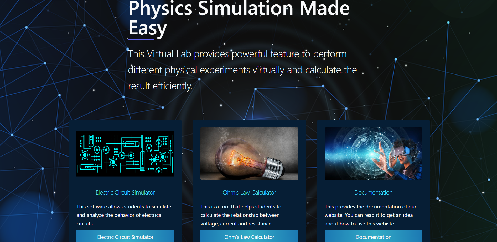

# Virtual-Physics-Lab

This is a virtual physics simulation web app made by using javascript and Draw2d.js.

Our site is live at https://andc-lab.netlify.app/

# 🎯 Problem Statement :-

Our goal is to create a Virtual Physics Lab Software that offers an engaging and authentic simulation environment for students to conduct physics experiments. The platform should incorporate realistic physics simulations, interactive elements, and intuitive controls to provide an immersive learning experience. It should also include a wide range of experiments and measurements, as well as data analysis tools, to help students understand and apply fundamental physics principles. The goal is to design a user-friendly and feature-rich virtual physics lab that promotes active learning and facilitates the exploration of various physics concepts in a virtual setting.

# 🔧 Tech Stack Used :-

<strong>MERN Stack</strong>
<ol>
<li>Tailwind CSS => for designing the UI/UX</li>
<li>React js => for creating the software (especially circuit simulator)</li>
<li>Node js => for creating a server for this software</li>
<li>Express js => for doing all the stuff in backend</li>
<li>MongoDB => for creating a database (if required)</li>
<li>Firebase => Will use it to store user data</lo>
</ol>

# 💰 Cost Estimate :-

Cost = Effort(pm) * Developer Charge(INR/pm)
 
Cost = 8.62 * 25,000
 
Cost = Rs 2,15,000

#  🎬 Demo :-

# ⚡ Challenges Faced :-

<ol>
<li>Drag & Drop functionality of circuit simulator was the most difficult part of this project.</li>
<li>Connecting the two components together in circuit simulator was a big challange for us.</li>
</ol>

# 🤝🏻 Contribution :-

We welcome contributions from the community! Whether you're an experienced developer or just getting started, there are many ways you can contribute to this project.
 

**Bug Reports and Feature Requests**

If you come across a bug or have an idea for a new feature, please [open an issue](https://github.com/AstroDeveloper1010/Virtual-Physics-Lab/issues) on GitHub. Be sure to provide as much detail as possible, including steps to reproduce the issue or a clear description of the feature you're suggesting.

**Pull Requests**

If you'd like to contribute code, follow these steps:

1. Fork the repository and create a new branch: `git checkout -b feature-name`.
2. Make your changes and ensure they're well-tested.
3. Commit your changes: `git commit -m 'Add some feature'`.
4. Push to your forked repository: `git push origin main`.
5. Open a pull request against the `main` branch of the original repository.

# 👥 Contributors :-

<ol>
<li>Priyanshu Jha</li>
<li>Nikhil Kumar</li>
<li>Vipin Kumar</li>
</ol>

<h3>Project Completed 👍</h3>

# 📃 Certificate :-

<h2>ACHARYA NARENDRA DEV COLLEGE</h2>

<h2>(University of Delhi)</h2>

<h2>CERTIFICATE</h2>

 

This is to certify that <strong>Priyanshu, Nikhil Kumar</strong> and <strong>Vipin Kumar</strong> of Bachelor of Science (Hons)
Computer Science from Acharya Narendra Dev College, University of Delhi, have successfully
completed the project <strong>“Virtual Electronics Lab”</strong> during Semester IV under the supervision of Prof.
<strong>Vibha Gaur</strong>.

   

Priyanshu Nikhil Kumar Vipin Kumar

 
 

Supervisor

   

Dr. Vibha Gaur, Professor

   

Department of Computer Science

